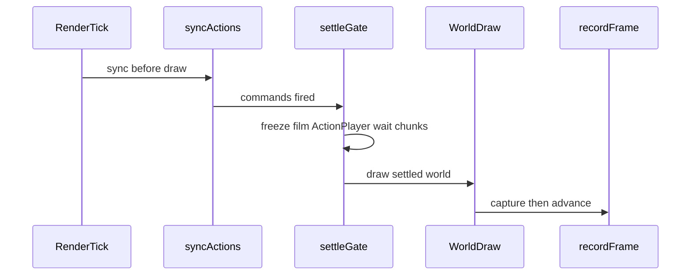

# High Quality Video Render Mode

## Goal

Add a video-settings toggle so weak PCs export nearly the same visual quality as strong PCs: commands like `/fill` finish and chunk meshes settle before a frame is captured. Export takes longer; quality does not drop.

## Approach (committed)

Full settle path — not heldFrames-only:

1. Sync action/command clips **before** world draw on capture frames.
2. After commands/actions fire, enter a **settle** window: freeze film clock and ActionPlayer firing.
3. Wait settle ticks + near-camera chunk rebuild idle (with hard timeout).
4. Then capture; bump effective `heldFrames` to at least 3 while HQ is on.

## Settings / UI

- [`ValueVideoSettings.java`](src/main/java/mchorse/bbs_mod/settings/values/ui/ValueVideoSettings.java)
  - `highQualityRender` (`ValueBoolean`, default `false`)
  - `highQualitySettleTicks` (`ValueInt`, default `4`, range `1..40`)
- [`UIValueMap.java`](src/client/java/mchorse/bbs_mod/settings/ui/UIValueMap.java) — toggle + trackpad next to held frames / warmup
- `UIKeys` + `en_us.json` strings/tooltips

## Runtime changes

| Piece | Change |
|-------|--------|
| [`BBSModClient`](src/client/java/mchorse/bbs_mod/BBSModClient.java) | Call `syncExportActions` before world render when recording+canRender; raise submit timeout in HQ (e.g. 2000ms) |
| [`VideoRecorder`](src/client/java/mchorse/bbs_mod/utils/VideoRecorder.java) | Settle state: `requestSettle`, remaining ticks, timeout deadline; `isSettling()` |
| [`ActionManager`](src/main/java/mchorse/bbs_mod/actions/ActionManager.java) / [`ActionPlayer`](src/main/java/mchorse/bbs_mod/actions/ActionPlayer.java) | `freezeActions` during settle so extra server work does not fire future clips |
| [`RenderTickCounterMixin`](src/client/java/mchorse/bbs_mod/mixin/client/RenderTickCounterMixin.java) | While settling: do not advance film/`serverTicks`/`counter`; allow client frames for mesh; exit when settle done |
| Iris timer mixin | Mirror the same settle gate so shader time stays locked |
| Chunk wait helper | Poll unfinished section builds near camera (accessor/reflection); timeout always |

## Out of scope

- Changing ffmpeg codec/preset defaults
- Guaranteeing 100% bitwise match across GPUs (target: same completeness/smoothness for world edits)

## Test plan

1. Large `/fill` command clips on consecutive ticks; HQ off vs on
2. HQ on: fill complete in correct frames; export slower
3. No Iris / with Iris: no crash
4. Non-command films still export normally with minimal extra delay
