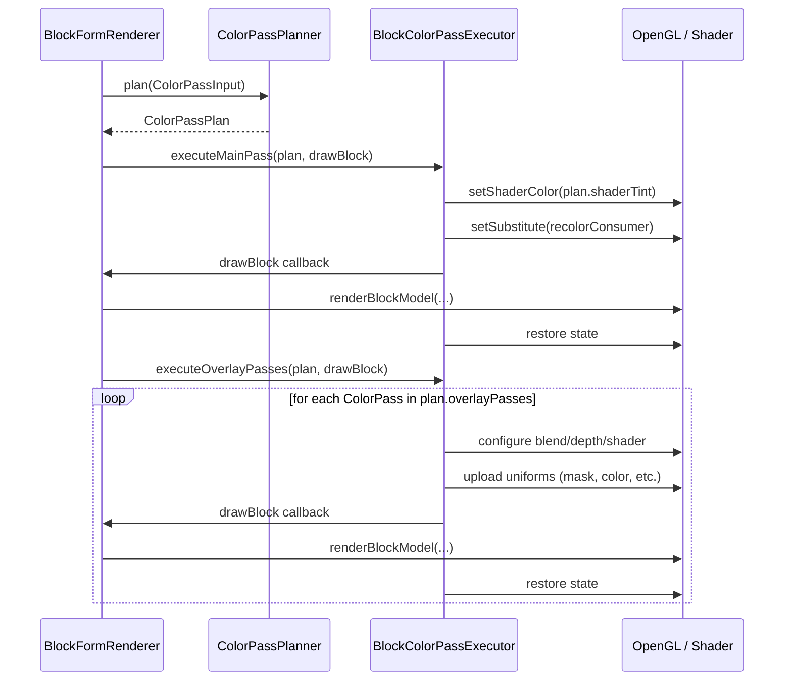

# Documento Maestro: Rediseño Integral de Color Masks & Color Transforms

> **Branch de referencia**: `master` (1.21.1)
> **Estado actual**: Funcionalmente correcto en 1.21.1; bugs persistentes en 1.20.x derivados de back-ports mal alineados.
> **Objetivo**: Reemplazar la totalidad del pipeline de renderizado de Color Masks (Paint, Glow) y Color Transforms por una arquitectura limpia, unificada, desacoplada por versión y de alto rendimiento.
> **Restricción**: La UI permanece intacta. Solo se reescribe la infraestructura de renderizado, shaders, intermediarios y lógica de mezcla.

---

## Tabla de Contenidos

1. [Auditoría del Sistema Actual](#1-auditoría-del-sistema-actual)
2. [Mapa de Dependencias y Flujo de Datos](#2-mapa-de-dependencias-y-flujo-de-datos)
3. [Inventario de Deuda Técnica](#3-inventario-de-deuda-técnica)
4. [Requisitos de Paridad Visual](#4-requisitos-de-paridad-visual)
5. [Arquitectura Propuesta](#5-arquitectura-propuesta)
6. [Diseño de Shaders](#6-diseño-de-shaders)
7. [Gestión de Estado OpenGL](#7-gestión-de-estado-opengl)
8. [Integración Iris / Sodium](#8-integración-iris--sodium)
9. [Capa de Adaptación Multi-Versión](#9-capa-de-adaptación-multi-versión)
10. [Hoja de Ruta de Implementación](#10-hoja-de-ruta-de-implementación)
11. [Plan de Verificación](#11-plan-de-verificación)
12. [Glosario](#12-glosario)

---

## 1. Auditoría del Sistema Actual

### 1.1 Componentes del Subsistema

El subsistema de Color Masks + Color Transforms está compuesto por las siguientes capas:

| Capa | Archivos Clave | Responsabilidad |
|------|----------------|-----------------|
| **Datos / Modelo** | `PaintSettings`, `GlowSettings`, `EffectTransform`, `EffectTransformMath`, `Color` (con `transform`, `brightness`, `contrast`, `hue`, `saturation`) | Almacenamiento serializable de paint/glow RGB, intensidad, spatial transform, y color grade (BCHSS). |
| **Lógica de resolución** | `FormColorEffects` (453 líneas) | Centraliza reglas de decisión: `wantsPaintOverlay`, `defersNegativePaintToOverlay`, `wantsNegativeGlowOverlay`, `wantsColorTintOverlay`, `shouldBakeFormColor`, `resolvePaintOverlayDrawColor`, blending helpers. |
| **State manager** | `BlockEffectOverlayUniforms` (996 líneas) | Configura OpenGL blend/depth state y sube uniforms de máscaras espaciales a los programas overlay de block/item/structure. |
| **Shaders (block-space)** | `block_paint_overlay.fsh`, `block_color_tint_overlay.fsh`, `block_glow_overlay.fsh` + `.vsh` + `.json` | Overlays para Block/Item/Structure forms. Cada `.fsh` duplica `bbsPaintEffectMask()` y `bbsSdTriangle2D()`. |
| **Shaders (flat/billboard)** | `flat_paint_overlay.fsh`, `flat_color_tint_overlay.fsh` + `.vsh` + `.json` | Overlays para Billboard, Label, Trail, Shape forms. También duplican `bbsPaintEffectMask()`. |
| **Shader maestro** | `model.fsh` (474 líneas) | Shader del VAO/BOBJ de ModelForm. Combina paint overlay, glow, color tint masked, color grade overlay, todo en un único fragment shader con 63+ uniforms. |
| **Renderers** | `BlockFormRenderer` (1970 líneas), `ItemFormRenderer` (986 líneas), `StructureFormRenderer` (1923 líneas), `StructureFormOverlayRenderer` (594 líneas), `BillboardFormRenderer`, `LabelFormRenderer`, `ShapeFormRenderer`, `TrailFormRenderer`, `ExtrudedFormRenderer` | Cada renderer implementa su propia orquestación de passes de overlay, con duplicación masiva de lógica. |
| **VertexConsumer wrappers** | `BlockPaintVertexConsumer`, `RecolorVertexConsumer`, `GlowEmissionVertexConsumer` | Interceptan vertex color para bake de paint/glow/recolor en el main pass. |
| **VAO/Bone** | `ModelVAORenderer`, `BobjBoneDrawEffects`, `CubicVAORenderer`, `CubicCpuGroupDrawRenderer` | Per-bone paint/glow/tint/grade uniforms para BOBJ skinned meshes. |
| **Flat overlay passes** | `FlatPaintOverlayPass`, `FlatGlowOverlayPass`, `FlatColorTintOverlayPass` | Encapsulan setup/teardown GL para Billboard/Label/Shape overlays. |
| **Iris integration** | `ShaderOpacityPatch`, `BBSRendering.*` helpers, `ColorAttributeMixin` (Sodium) | Deferral de overlays a post-deferred, noshading, shadow pass, y framebuffer capture para Color Grade. |

### 1.2 Forms que Usan Color Masks

| Form | Paint | Glow | Color Tint/Transform | Color Grade | Path |
|------|-------|------|---------------------|-------------|------|
| **BlockForm** | ✅ positive overlay + negative darken/bake | ✅ positive overlay + negative ColorModulator | ✅ spatial mask (DST_COLOR) | ✅ framebuffer regrade | `BlockFormRenderer` |
| **ItemForm** | ✅ (misma lógica que Block) | ✅ (misma lógica que Block) | ✅ | ✅ | `ItemFormRenderer` |
| **StructureForm** | ✅ VAO paint + atlas paint overlay | ✅ overlay + negative darken | ✅ | ✅ | `StructureFormRenderer` + `StructureFormOverlayRenderer` |
| **ModelForm** | ✅ VAO `model.fsh` (per-bone) | ✅ VAO `model.fsh` (per-bone) | ✅ VAO masked | ✅ VAO | `ModelFormRenderer` + `ModelVAORenderer` + `BobjBoneDrawEffects` |
| **BillboardForm** | ✅ flat_paint_overlay | ✅ flat + masked | ✅ flat_color_tint | ❌ (no grade) | `BillboardFormRenderer` |
| **LabelForm** | ✅ flat_paint_overlay | ✅ flat + masked | ✅ flat_color_tint | ❌ | `LabelFormRenderer` |
| **ShapeForm** | ✅ flat_paint_overlay | ✅ inline | ✅ flat_color_tint | ❌ | `ShapeFormRenderer` |
| **TrailForm** | ✅ flat_paint_overlay | ✅ flat | ❌ | ❌ | `TrailFormRenderer` |
| **ExtrudedForm** | ✅ (limited) | ❌ | ❌ | ❌ | `ExtrudedFormRenderer` |

### 1.3 Rutas de Renderizado por Signo de Intensidad

```
Paint Intensity:
  > 0 (positive) → Overlay pass (SRC_ALPHA, ONE_MINUS_SRC_ALPHA) con color RGB
  < 0 (negative) → 
    Sin transform activo:   Bake en vertex (BlockPaintVertexConsumer) → factor = max(0, 1+intensity)
    Con transform activo:   Overlay pass (DST_COLOR, ZERO) → multiply darken con spatial mask
  = 0 → No-op

Glow Intensity:
  > 0 (positive) →
    Sin transform:  Multi-layer additive overlay (SRC_ALPHA, ONE) o bake en main pass (Iris bloom)
    Con transform:  Masked overlay con GlowScale
    PaintOnly:      Glow modula solo dentro del paint mask → uniform GlowOverlayColor en block_paint_overlay
  < 0 (negative) →
    Sin transform:  ColorModulator darken (factor = max(0, 1+intensity))
    Con transform:  Overlay pass (DST_COLOR, ZERO) → multiply darken con spatial mask
  = 0 → No-op

Color Tint (form color.rgb con transform activo):
  → Overlay pass (DST_COLOR, ZERO) con FormColorTint uniform → multiply mask
  → O bake en vertex cuando no hay transform activo

Color Grade (brightness/contrast/hue/saturation):
  → Framebuffer capture + regrade pass (cuando Iris soporta Sampler3)
  → O bake en color tint overlay (sin Iris)
  → Per-channel spatial masks (GradeBrightness/Contrast/Hue/Saturation × {Inverse, Half, Active, BottomAnchored, Shape})
```

---

## 2. Mapa de Dependencias y Flujo de Datos

```mermaid
graph TD
    subgraph "Data Layer (Shared src/main)"
        PS[PaintSettings<br/>r,g,b,intensity,transform]
        GS[GlowSettings<br/>r,g,b,intensity,paintOnly,transform]
        ET[EffectTransform<br/>offset,scale,rotate,pivot,shape]
        FC[Color<br/>r,g,b,a + transform + BCHSS]
    end

    subgraph "Resolution Layer (Client)"
        FCE[FormColorEffects<br/>Decision logic + blending]
    end

    subgraph "GL State Layer (Client)"
        BEOU[BlockEffectOverlayUniforms<br/>State config + uniform upload]
        FPOP[FlatPaintOverlayPass<br/>Billboard/Label state]
        FGOP[FlatGlowOverlayPass]
        FCTOP[FlatColorTintOverlayPass]
    end

    subgraph "Shader Layer"
        BPO[block_paint_overlay.fsh]
        BCT[block_color_tint_overlay.fsh]
        BGO[block_glow_overlay.fsh]
        FPO[flat_paint_overlay.fsh]
        FCT[flat_color_tint_overlay.fsh]
        MOD[model.fsh]
    end

    subgraph "Renderer Layer"
        BFR[BlockFormRenderer]
        IFR[ItemFormRenderer]
        SFR[StructureFormRenderer]
        SFOR[StructureFormOverlayRenderer]
        MFR[ModelFormRenderer + ModelVAORenderer]
        BBFR[BillboardFormRenderer]
        LFR[LabelFormRenderer]
        SHFR[ShapeFormRenderer]
        TFR[TrailFormRenderer]
    end

    PS --> FCE
    GS --> FCE
    FC --> FCE
    ET --> BEOU
    ET --> FPOP

    FCE --> BFR
    FCE --> IFR
    FCE --> SFOR
    FCE --> BBFR

    BEOU --> BPO
    BEOU --> BCT
    BEOU --> BGO
    FPOP --> FPO
    FCTOP --> FCT

    BFR --> BPO
    BFR --> BCT
    BFR --> BGO
    IFR --> BPO
    IFR --> BCT
    SFR --> SFOR
    SFOR --> BPO
    SFOR --> BCT
    SFOR --> BGO
    BBFR --> FPO
    BBFR --> FCT
    LFR --> FPO
    LFR --> FCT
    SHFR --> FPO
    MFR --> MOD
```



---

## 3. Inventario de Deuda Técnica

### 3.1 Duplicación de Código GLSL

La función `bbsPaintEffectMask()` (37 líneas) y `bbsSdTriangle2D()` (17 líneas) están **duplicadas verbatim** en **6 archivos `.fsh`**:

| Archivo | `bbsPaintEffectMask` | `bbsSdTriangle2D` |
|---------|---------------------|-------------------|
| `model.fsh` | ✅ | ✅ |
| `block_paint_overlay.fsh` | ✅ | ✅ |
| `block_color_tint_overlay.fsh` | ✅ | ✅ |
| `block_glow_overlay.fsh` | ✅ | ✅ |
| `flat_paint_overlay.fsh` | ✅ (variant con `falloffWorld`) | ✅ |
| `flat_color_tint_overlay.fsh` | ✅ (variant con `falloffWorld`) | ✅ |

**Impacto**: Cualquier corrección de la máscara requiere 6 ediciones simultáneas. La variante `flat_*` acepta un parámetro adicional `falloffWorld`, lo que impide un simple copy-paste.

### 3.2 Duplicación de Lógica Java

La función `bbsApplyFormColorGrade()` también está duplicada en `model.fsh` y `block_color_tint_overlay.fsh`. Los helpers HSL (`bbsRgb2Hsl`, `bbsHsl2Rgb`, `bbsHue2Rgb`) están duplicados en ambos.

### 3.3 Explosión de Uniforms en `model.fsh`

`model.fsh` declara **63+ uniforms**, incluyendo:
- 5 uniforms × 4 grade channels (Brightness, Contrast, Hue, Saturation) × {Inverse, Half, Active, BottomAnchored, Shape} = **20 grade mask uniforms**
- Paint: 5 uniforms (PaintEffectInverse, PaintMaskHalf, PaintEffectActive, PaintMaskBottomAnchored, PaintMaskShape)
- Glow: 5 uniforms
- Color: 5 uniforms
- FormColorTint, FormColorGrade, PaintColor, GlowingColor, etc.

**Impacto**: Penalidad de rendimiento en cada draw call de modelo. Muchos de estos uniforms están en `vec4(0)` la mayoría del tiempo.

### 3.4 Orquestación de Passes Duplicada por Renderer

Cada renderer (Block, Item, Structure, Billboard, Label, Shape, Trail) implementa su **propia copia** de la lógica de:
1. Decidir si se ejecuta paint/glow/color overlay
2. Configurar OpenGL state (blend, depth, polygon offset)
3. Manejar Iris deferral (world paint deferral, soft post-deferred, noshading)
4. Snapshot de estado para lambdas diferidas
5. Restaurar OpenGL state en finally blocks

**Ejemplo**: `BlockFormRenderer.render3D()` tiene **~400 líneas** de orquestación de passes. `ItemFormRenderer.render3D()` tiene **~350 líneas** casi idénticas. `StructureFormRenderer` delega a `StructureFormOverlayRenderer` pero la lógica de decisión está en el renderer principal.

### 3.5 Inconsistencia de Blending por Signo

| Configuración | Blend Mode | Semántica |
|---------------|-----------|-----------|
| Paint +, sin transform | `SRC_ALPHA, ONE_MINUS_SRC_ALPHA` | Alpha blend hacia paint color |
| Paint −, sin transform | Bake en vertex `factor * rgb` | Darken directo (no overlay) |
| Paint −, con transform | `DST_COLOR, ZERO` | Multiply darken con máscara espacial |
| Glow +, sin transform | `SRC_ALPHA, ONE` | Additive emission |
| Glow −, sin transform | ColorModulator `factor, factor, factor, 1` | Darken via setShaderColor |
| Glow −, con transform | `DST_COLOR, ZERO` | Multiply darken con máscara |
| Color tint, sin grade | `DST_COLOR, ZERO` | Multiply tint |
| Color tint + grade | `SRC_ALPHA, ONE_MINUS_SRC_ALPHA` (default) | Replace con framebuffer regrade |

**Impacto**: La mezcla de `DST_COLOR/ZERO` y `SRC_ALPHA/ONE_MINUS_SRC_ALPHA` en el mismo pipeline crea **interacciones no lineales** cuando múltiples efectos están activos simultáneamente (ej: paint + glow + color tint). El orden de los passes importa y no está formalizado.

### 3.6 `BlockEffectOverlayUniforms` como God Object

Con **996 líneas** y **20+ overloads** de `configurePaintOverlayRenderState`, esta clase mezcla:
- Configuración de OpenGL blend/depth state
- Upload de uniforms de shader
- Resolución de mask half-extents (delegando a `EffectTransformMath`)
- Binding de texturas (block atlas)
- Lógica condicional por tipo de form (structure-sized, entity-visual, flat)

### 3.7 Estado Global Mutable

- `BlockFormRenderer.color` es un campo `public static final Color` compartido por Block e Item renderers.
- `BlockEffectOverlayUniforms.blockVisualMaskSize` es un `static Vector3f` set/cleared con begin/end patrón.
- `ModelVAORenderer` usa métodos estáticos `setPaint()`, `setGlow()`, `setGroupPaint()` etc. con estado global mutable.

### 3.8 Shadow Pass Workarounds

Múltiples `no-op` methods heredados de iteraciones anteriores de bug fixes:
- `finishShadowOpacity()` → no-op
- `applyShadowPassColorFix()` → no-op
- `resolveEffectShaderShadow()` → siempre retorna `SHADER_SHADOW_DEFAULT`

Estos métodos existían para parchear un bug de Complementary Shaders que aplastaba el alfa en shadow maps, eliminando sombras de suelo. El fix actual simplemente no modifica el alfa, pero los call sites y la API legacy permanecen.

---

## 4. Requisitos de Paridad Visual

### 4.1 Matriz de Comportamiento a Preservar

| Escenario | Sin Shaders | Con Iris/Sodium | Shadow Pass |
|-----------|-------------|-----------------|-------------|
| Paint +1, rojo, sin transform | Vertex bake → rojo sólido | Iris overlay → rojo sólido | Alpha del form, no paint |
| Paint −0.5, sin transform | Vertex bake → darken 50% | Vertex bake → darken 50% | No darken |
| Paint −0.5, con transform box 0.5 | DST_COLOR overlay → darken espacial | Iris deferred DST_COLOR | No darken |
| Glow +1, blanco, sin transform | Additive overlay × N layers | Iris bloom: ColorModulator > 1 | No glow |
| Glow +0.3, con transform circle | Masked additive overlay | Iris deferred additive | No glow |
| Glow −0.5, sin transform | ColorModulator darken | ColorModulator darken | No darken |
| Glow −0.5, con transform | DST_COLOR darken overlay | Iris deferred DST_COLOR | No darken |
| Color tint (0.5, 0, 0), transform | DST_COLOR multiply (rojo) | DST_COLOR multiply | No tint |
| Color Grade brightness +0.3 | `block_color_tint_overlay` | Framebuffer regrade | No grade |
| Combinación: paint + glow + tint | Passes secuenciales | Iris deferred secuenciales | Solo alpha |
| Soft opacity (alpha < 1) | Post-deferred queue | Post-deferred queue | Alpha pass-through |
| Entity-visual (sign/chest) | BE tint bake + overlays | Iris deferred | BE tint bake |

### 4.2 Reglas Inamovibles

1. **Paint nunca modifica alpha del geometry** — solo RGB. El alpha del form controla opacity.
2. **Glow PaintOnly** sigue la máscara de paint, no la de glow.
3. **Negative paint/glow sin transform**: se bake en vertices (no overlay).
4. **Negative paint/glow con transform**: se usa overlay DST_COLOR/ZERO.
5. **Shadow pass**: nunca aplica paint/glow/tint/grade. Solo pasa form opacity como alpha.
6. **Color Grade**: usa framebuffer capture cuando Iris soporta Sampler3; fallback a DST_COLOR tint.
7. **Per-bone overrides en ModelForm**: cada bone puede tener su propio paint/glow/tint/grade.

---

## 5. Arquitectura Propuesta

### 5.1 Principio: Pipeline de 3 Capas Desacopladas

```
┌─────────────────────────────────────────────────────┐
│  CAPA 1 — Resolution (version-agnostic)             │
│  Input:  PaintSettings, GlowSettings, Color, alpha  │
│  Output: ColorPassPlan (lista de passes a ejecutar) │
└───────────────────────┬─────────────────────────────┘
                        │ ColorPassPlan
┌───────────────────────▼─────────────────────────────┐
│  CAPA 2 — Pass Executor (version-specific adapter)  │
│  Input:  ColorPassPlan + geometry draw callback      │
│  Does:   Configura GL state, sube uniforms, ejecuta │
│          cada pass en orden, restaura state          │
└───────────────────────┬─────────────────────────────┘
                        │ Uniform values
┌───────────────────────▼─────────────────────────────┐
│  CAPA 3 — Shaders (shared GLSL includes)            │
│  Input:  Uniforms + vertex data                      │
│  Does:   Evalúa máscara espacial, aplica efecto      │
└─────────────────────────────────────────────────────┘
```

### 5.2 Capa 1: Resolution — `ColorPassPlanner`

**Nueva clase**: `ColorPassPlanner` (reemplaza `FormColorEffects` + la lógica dispersa en renderers)

```java
public final class ColorPassPlanner
{
    /**
     * Analiza los ajustes de color de un form y produce un plan de passes.
     * Determinístico, sin efectos secundarios, sin OpenGL.
     */
    public static ColorPassPlan plan(ColorPassInput input)
    {
        ColorPassPlan plan = new ColorPassPlan();

        /* 1. Main pass modifications */
        planMainPassBake(input, plan);

        /* 2. Color tint overlay (DST_COLOR multiply) */
        planColorTintOverlay(input, plan);

        /* 3. Paint overlay (alpha blend or DST_COLOR darken) */
        planPaintOverlay(input, plan);

        /* 4. Glow overlay (additive or DST_COLOR darken) */
        planGlowOverlay(input, plan);

        /* 5. Color grade overlay (framebuffer regrade) */
        planColorGradeOverlay(input, plan);

        return plan;
    }
}
```

**`ColorPassInput`**: inmutable record con todo lo necesario para tomar decisiones:

```java
public record ColorPassInput(
    Color storedFormColor,
    PaintSettings paintSettings,
    Color legacyPaint,
    GlowSettings glowSettings,
    Color legacyGlow,
    float formAlpha,
    boolean shadowPass,
    boolean picking,
    boolean irisEnabled,
    boolean irisWorldPaintDeferral,
    boolean irisShadowPass,
    boolean localPreview,
    boolean blockEntityVisual,
    FormGeometryType geometryType  /* BLOCK_ATLAS, FLAT_QUAD, VAO_MODEL */
) {}
```

**`ColorPassPlan`**: lista ordenada de `ColorPass` descriptores:

```java
public final class ColorPassPlan
{
    /* Main pass modifications (vertex bake, ColorModulator) */
    public Color vertexTint = Color.white();
    public Color shaderTint = null;   /* ColorModulator override */
    public Color mainPassPaint = null; /* Negative paint for vertex bake */

    /* Ordered overlay passes */
    public final List<ColorPass> overlayPasses = new ArrayList<>();
}

public sealed interface ColorPass
{
    record PaintOverlay(Color drawColor, boolean multiplyDarken,
                        EffectTransform transform, GlowSettings paintOnlyGlow,
                        Color legacyGlow, float glowIntensity, float alpha) implements ColorPass {}

    record GlowOverlay(GlowSettings glow, Color legacyGlow, float intensity,
                       float alpha, EffectTransform transform, boolean darken) implements ColorPass {}

    record ColorTintOverlay(Color formColor, EffectTransform transform,
                            Color gradeSource) implements ColorPass {}

    record ColorGradeOverlay(Color gradeSource) implements ColorPass {}
}
```

**Ventajas**:
- Toda la lógica de decisión vive en **un solo lugar** testeable.
- Los renderers no necesitan duplicar `if (positiveGlow && !glowSettings.resolvePaintOnly() && ...)`.
- El plan es inspeccionable y logeable para debugging.
- **Zero dependencia de versión**: no usa OpenGL ni APIs de Minecraft.

### 5.3 Capa 2: Pass Executor — `ColorPassExecutor`

**Interfaz**:

```java
public interface ColorPassExecutor
{
    void executeMainPass(ColorPassPlan plan, Runnable drawGeometry);
    void executeOverlayPasses(ColorPassPlan plan, Runnable drawGeometry);
    void executeDeferredOverlayPasses(ColorPassPlan plan, DeferralContext ctx);
}
```

**Implementaciones** por tipo de geometría:
- `BlockColorPassExecutor` — para Block/Item forms (block atlas overlays)
- `StructureColorPassExecutor` — para Structure forms (structure-sized masks)
- `FlatColorPassExecutor` — para Billboard/Label/Shape/Trail (flat overlays)
- `VaoColorPassExecutor` — para Model forms (model.fsh uniforms)

Cada implementación encapsula:
1. **Setup GL state** (blend mode, depth test/mask, polygon offset)
2. **Upload de uniforms** al shader correspondiente
3. **Bind de texturas** (block atlas, framebuffer capture)
4. **Invoke draw callback**
5. **Restore GL state** en finally

**Ventajas**:
- El renderer solo hace: `executor.executeMainPass(plan, this::renderGeometry)` + `executor.executeOverlayPasses(plan, this::renderGeometry)`.
- La lógica de Iris deferral vive en el executor, no en cada renderer.
- Los executors son la **única capa version-specific** (diferentes en 1.20.x vs 1.21.x).

### 5.4 Capa 3: Shaders — GLSL Include System

**Problema actual**: 6 copias de `bbsPaintEffectMask()`.

**Solución**: Usar `#moj_import` (ya soportado por Minecraft) para compartir código:

**`bbs_mask.glsl`** (nuevo archivo include):
```glsl
/* Shared spatial mask evaluation — all BBS overlay shaders import this. */

float bbsSdTriangle2D(vec2 p, vec2 a, vec2 b, vec2 c) { ... }

float bbsPaintEffectMask(vec3 rootPos, mat4 effectInverse, float activeFlag,
                         vec3 halfExtents, float bottomAnchored, float shape)
{ ... }

/* Variant with explicit falloff for flat/billboard overlays */
float bbsPaintEffectMaskFalloff(vec3 rootPos, mat4 effectInverse, float activeFlag,
                                vec3 halfExtents, float falloffWorld,
                                float bottomAnchored, float shape)
{ ... }
```

**`bbs_color_grade.glsl`** (nuevo archivo include):
```glsl
/* HSL conversion + Color Grade application — shared by model.fsh and block_color_tint_overlay.fsh */

vec3 bbsRgb2Hsl(vec3 c) { ... }
float bbsHue2Rgb(float p, float q, float t) { ... }
vec3 bbsHsl2Rgb(vec3 hsl) { ... }
vec3 bbsApplyFormColorGrade(vec3 rgb, vec3 rootPos) { ... }
```

**`bbs_glow.glsl`** (nuevo archivo include):
```glsl
vec3 bbsApplyGlow(vec3 color, float strength, vec3 glowRgb) { ... }
```

**Cada `.fsh` simplificado**:
```glsl
#moj_import <bbs_mask.glsl>
#moj_import <bbs_color_grade.glsl>  /* solo donde se necesite */

void main() { ... }
```

### 5.5 Refactored `BlockEffectOverlayUniforms` → `OverlayUniformUploader`

Dividir en clases cohesivas:

| Clase Nueva | Responsabilidad |
|-------------|-----------------|
| `PaintMaskUniforms` | Upload de PaintEffectInverse, PaintMaskHalf, PaintEffectActive, PaintMaskBottomAnchored, PaintMaskShape |
| `ColorMaskUniforms` | Upload de ColorEffectInverse, ColorMaskHalf, etc. |
| `GradeMaskUniforms` | Upload de los 4 × 5 grade channel uniforms |
| `GlowUniforms` | Upload de GlowOverlayColor, GlowScale |
| `FormColorTintUniforms` | Upload de FormColorTint, FormRootInverse |
| `OverlayBlendState` | Setup de blend mode, depth, polygon offset (como static helpers) |

---

## 6. Diseño de Shaders

### 6.1 Reducción de Uniforms en `model.fsh`

**Propuesta**: Mover los 20 grade mask uniforms a un UBO (Uniform Buffer Object) o, si UBOs no son compatibles con el shader loader de Minecraft, usar un **texture buffer** de 4×5 floats.

**Alternativa pragmática** (menor impacto en el shader loader): mantener los uniforms pero **solo subirlos cuando `FormColorGrade` tiene valores no-zero**. Actualmente `ModelVAORenderer` sube los 20 uniforms en *cada* draw call incluso cuando no hay Color Grade activo.

### 6.2 Shader de Overlay Unificado

Considerar fusionar `block_paint_overlay.fsh`, `block_glow_overlay.fsh` y el path de `block_color_tint_overlay.fsh` (non-grade) en un **único shader** con un uniform selector:

```glsl
uniform float OverlayMode; /* 0=paint, 1=glow, 2=colorTint, 3=darken */
```

**Trade-off**: Un shader más grande pero **una sola compilación**, vs tres shaders pequeños que comparten 80% del código.

**Recomendación**: Mantener shaders separados pero con includes compartidos. La compilación de 3 shaders simples es más rápida y el driver puede optimizar mejor el branching eliminado estáticamente.

---

## 7. Gestión de Estado OpenGL

### 7.1 Estado Actual: Manual, Disperso, Frágil

Cada renderer y cada pass hace llamadas explícitas a:
- `RenderSystem.enableBlend()` / `disableBlend()`
- `RenderSystem.blendFunc()` / `blendFuncSeparate()`
- `RenderSystem.depthMask()` / `depthFunc()`
- `RenderSystem.setShaderColor()`
- `GL11.glEnable/glDisable(GL_POLYGON_OFFSET_FILL)`
- `GL11.glPolygonOffset()`
- `RenderSystem.enableCull()` / `disableCull()`

Con save/restore manual en variables locales. Patrón frágil y propenso a leaks.

### 7.2 Propuesta: `GlStateScope`

```java
public final class GlStateScope implements AutoCloseable
{
    private final int savedBlendSrc, savedBlendDst;
    private final boolean savedDepthMask, savedBlend, savedCull;
    private final boolean savedPolygonOffset;
    private final int savedDepthFunc;

    public GlStateScope()
    {
        /* Capture current state */
        this.savedBlend = GL11.glIsEnabled(GL11.GL_BLEND);
        // ... etc
    }

    @Override
    public void close()
    {
        /* Restore all captured state */
    }

    /* Fluent API for configuration */
    public GlStateScope blend(int src, int dst) { ... return this; }
    public GlStateScope depthMask(boolean write) { ... return this; }
    public GlStateScope polygonOffset(float factor, float units) { ... return this; }
}
```

**Uso**:
```java
try (GlStateScope scope = new GlStateScope()
        .blend(GL11.GL_SRC_ALPHA, GL11.GL_ONE)
        .depthMask(false)
        .polygonOffset(-1F, -16F))
{
    drawOverlay();
}
/* State automatically restored */
```

---

## 8. Integración Iris / Sodium

### 8.1 Puntos de Integración Actuales

1. **`BBSRendering.isIrisWorldPaintDeferral()`**: Indica que estamos en el gbuffer pass de Iris y los overlays deben diferirse al composite pass.
2. **`BBSRendering.isIrisShadowPass()`**: Shadow map pass — no aplicar efectos visuales.
3. **`ShaderOpacityPatch.shouldDelayUntilPostDeferred()`**: Formas soft-opacity se encolan para renderizar después del deferred pass.
4. **`ModelVAORenderer.submitPaintOverlay()` / `submitColorTintOverlay()`**: Encolan lambdas para ejecución post-composite.
5. **`ModelVAORenderer.capturePaintOverlayRootMatrix()`**: Captura la model-view matrix para overlay submissions.
6. **`ModelVAORenderer.captureGradeSceneColor()`**: Copia el framebuffer lit para Color Grade regrade.
7. **`ColorAttributeMixin`** (Sodium): Parchea el manejo de color attributes en Sodium para compatibilidad.

### 8.2 Simplificación en el Rediseño

El `ColorPassExecutor` encapsula la decisión de "render ahora vs. defer":

```java
class BlockColorPassExecutor implements ColorPassExecutor
{
    @Override
    public void executeOverlayPasses(ColorPassPlan plan, Runnable drawGeometry)
    {
        if (BBSRendering.isIrisWorldPaintDeferral())
        {
            this.submitDeferredPasses(plan, drawGeometry);
        }
        else
        {
            this.renderImmediatePasses(plan, drawGeometry);
        }
    }
}
```

Los renderers no necesitan saber nada sobre Iris. El executor maneja el snapshot de matrices y colores para las lambdas diferidas.

---

## 9. Capa de Adaptación Multi-Versión

### 9.1 Diferencias Clave entre Versiones

| Aspecto | 1.21.1 (master) | 1.20.4 | 1.20.1 |
|---------|-----------------|--------|--------|
| `ShaderProgram` | `net.minecraft.client.gl.ShaderProgram` | `net.minecraft.client.gl.ShaderProgram` | `net.minecraft.client.render.Shader` |
| `GlUniform` | `net.minecraft.client.gl.GlUniform` | `net.minecraft.client.gl.GlUniform` | `net.minecraft.client.gl.Uniform` |
| `getUniform()` | `program.getUniform("name")` | Igual | `shader.getUniform("name")` (nullable) |
| `ModelViewStack` | `RenderSystem.getModelViewStack()` devuelve `Matrix4fStack` | Devuelve `MatrixStack` | Devuelve `MatrixStack` |
| `applyModelViewMatrix()` | Necesario tras push/set | Igual | Igual |
| Iris API | Iris 1.8+ | Iris 1.6+ | Iris 1.6+ |
| Sodium mixin target | `net.caffeinemc.mods.sodium` | `me.jellysquid.mods.sodium` | `me.jellysquid.mods.sodium` |
| `Identifier.of()` | Disponible | Disponible | Usa `new Identifier()` |

### 9.2 Interfaz de Adaptación

```java
public interface RenderApiAdapter
{
    /* Shader uniform upload */
    void uploadUniform(Object program, String name, float value);
    void uploadUniform(Object program, String name, float x, float y, float z, float w);
    void uploadUniform(Object program, String name, Matrix4f matrix);

    /* ModelView stack */
    void pushModelView(Matrix4f matrix);
    void popModelView();

    /* Shader program access */
    Object getPaintOverlayProgram();
    Object getColorTintOverlayProgram();
    Object getGlowOverlayProgram();
}
```

**Implementaciones**:
- `RenderApiAdapter_1_21_1` — usa `ShaderProgram`, `GlUniform`, `Matrix4fStack`
- `RenderApiAdapter_1_20_4` — igual API pero paquetes Sodium distintos
- `RenderApiAdapter_1_20_1` — usa `Shader`, `Uniform`, paquetes Sodium legacy

### 9.3 Estrategia de Porting

1. **Desarrollar todo en `master` (1.21.1)** con la nueva arquitectura.
2. **Crear un adapter para 1.21.1** (trivial: pass-through a la API nativa).
3. **Portar a 1.20.4**: solo crear `RenderApiAdapter_1_20_4` y ajustar import paths.
4. **Portar a 1.20.1**: crear `RenderApiAdapter_1_20_1` con wrappers de `Shader`→`ShaderProgram`.

---

## 10. Hoja de Ruta de Implementación

### Fase 0: Preparación (2-3 días)

- [ ] Crear snapshot de referencia visual: screenshots/videos del comportamiento actual con todas las combinaciones de paint/glow/tint/grade en Block, Item, Structure, Model, Billboard, Label, Shape forms.
- [ ] Escribir la tabla de referencia visual como fichero `.md` enlazando las capturas.
- [ ] Crear rama `refactor/color-pipeline` desde `master`.

### Fase 1: Capa de resolución — `ColorPassPlanner` (3-4 días)

- [ ] Crear `ColorPassInput`, `ColorPassPlan`, `ColorPass` sealed interface.
- [ ] Migrar toda la lógica de decisión de `FormColorEffects` a `ColorPassPlanner.plan()`.
- [ ] Mantener `FormColorEffects` como wrapper temporal delegando a `ColorPassPlanner`.
- [ ] Test: verificar que el plan generado para cada escenario de la tabla de paridad produce los mismos passes que el código actual.

### Fase 2: GLSL includes (1-2 días)

- [ ] Crear `bbs_mask.glsl`, `bbs_color_grade.glsl`, `bbs_glow.glsl`.
- [ ] Refactorizar los 6 `.fsh` para usar `#moj_import`.
- [ ] Verificar compilación de shaders in-game.

### Fase 3: Uniform uploaders (2-3 días)

- [ ] Crear `PaintMaskUniforms`, `ColorMaskUniforms`, `GradeMaskUniforms`, `GlowUniforms`, `FormColorTintUniforms`.
- [ ] Crear `OverlayBlendState` o `GlStateScope`.
- [ ] Migrar `BlockEffectOverlayUniforms` a delegar en las nuevas clases.
- [ ] Verificar que los overlays funcionan igual.

### Fase 4: Pass executors — Block/Item (3-4 días)

- [ ] Crear `ColorPassExecutor` interfaz.
- [ ] Implementar `BlockColorPassExecutor` incluyendo Iris deferral.
- [ ] Refactorizar `BlockFormRenderer.render3D()` para usar planner + executor.
- [ ] Refactorizar `ItemFormRenderer.render3D()` (debería ser casi idéntico a Block).
- [ ] Verificar paridad visual en Block y Item forms (con y sin shaders).

### Fase 5: Pass executors — Structure (2-3 días)

- [ ] Implementar `StructureColorPassExecutor` con soporte para structure-sized masks.
- [ ] Refactorizar `StructureFormRenderer` + `StructureFormOverlayRenderer`.
- [ ] Verificar paridad en Structure forms.

### Fase 6: Pass executors — Flat (Billboard/Label/Shape/Trail) (2-3 días)

- [ ] Implementar `FlatColorPassExecutor` usando flat_paint/color_tint overlays.
- [ ] Refactorizar Billboard, Label, Shape, Trail renderers.
- [ ] Verificar paridad en flat forms.

### Fase 7: Pass executors — VAO/Model (3-4 días)

- [ ] Implementar `VaoColorPassExecutor` para per-bone uniforms en `model.fsh`.
- [ ] Integrar con `BobjBoneDrawEffects` y `ModelVAORenderer`.
- [ ] Verificar paridad en Model forms con per-bone paint/glow.

### Fase 8: Limpieza (1-2 días)

- [ ] Eliminar `FormColorEffects` (wrapper temporal).
- [ ] Eliminar `BlockEffectOverlayUniforms` antiguo.
- [ ] Eliminar las `FlatPaintOverlayPass`, `FlatGlowOverlayPass`, `FlatColorTintOverlayPass` si han sido absorbidas por los executors.
- [ ] Eliminar dead code (no-op shadow methods, unused overloads).
- [ ] Limpiar estado global mutable (`BlockFormRenderer.color` estático).

### Fase 9: Adapter multi-versión (2-3 días)

- [ ] Crear `RenderApiAdapter` interfaz.
- [ ] Implementar adapter para 1.21.1.
- [ ] Portar a 1.20.4 (crear adapter, resolver import diffs).
- [ ] Portar a 1.20.1 (crear adapter con Shader→ShaderProgram bridge).

### Fase 10: Verificación final (2-3 días)

- [ ] Comparación A/B con las capturas de referencia de Fase 0.
- [ ] Test con shader packs: Complementary, BSL, Iris default.
- [ ] Test sin shaders (vanilla).
- [ ] Test de soft opacity, noshading, shadow casting.
- [ ] Profiling de rendimiento (FPS before/after con estructura grande + paint + glow + grade).

**Total estimado: 20-30 días de desarrollo**

---

## 11. Plan de Verificación

### 11.1 Test Matrix

Para cada form type × cada escenario de color:

| # | Escenario | Checklist |
|---|-----------|-----------|
| 1 | Paint +1 rojo, sin transform | [ ] Color correcto [ ] Alpha intacto [ ] Shadow intacto |
| 2 | Paint +0.5 rojo, sin transform | [ ] Blend 50% |
| 3 | Paint −0.5, sin transform | [ ] Darken 50% |
| 4 | Paint −0.5, transform box 0.5 | [ ] Darken espacial con bordes suaves |
| 5 | Paint +0.5, transform circle | [ ] Tint circular |
| 6 | Glow +1 blanco, sin transform | [ ] Additive correcto [ ] Iris bloom |
| 7 | Glow +0.3, transform circle | [ ] Additive masked |
| 8 | Glow −0.5, sin transform | [ ] Darken correcto |
| 9 | Glow −0.5, transform box | [ ] Darken masked |
| 10 | Glow PaintOnly | [ ] Glow solo donde paint activo |
| 11 | Color tint rojo, transform box 0.5 | [ ] Multiply mask rojo |
| 12 | Color Grade brightness +0.3 | [ ] Brighter correcto |
| 13 | Color Grade contrast −0.5 | [ ] Flatter contrast |
| 14 | Color Grade hue +180 | [ ] Color shift correcto |
| 15 | Color Grade saturation −1 | [ ] Desaturado |
| 16 | Combined: paint + glow + tint | [ ] Sin artefactos, orden correcto |
| 17 | Soft opacity (alpha = 0.5) | [ ] Post-deferred queue correcto |
| 18 | Shadow pass | [ ] Ground shadow intacto, no color bleeding |
| 19 | Entity-visual (sign) | [ ] BE tint correcto, no atlas corruption |
| 20 | Structure form con translucent blocks | [ ] Leaves dithering correcto |

### 11.2 Profiling Targets

| Métrica | Baseline (pre-refactor) | Target |
|---------|------------------------|--------|
| Draw calls por overlay pass | Medir | ≤ baseline |
| Uniform uploads por frame | ~63 × N modelos | Reducir a solo los activos |
| Frame time con 50 models + paint + glow | Medir | ≤ baseline |
| Shader compile time | Medir | Reducir (menos código por shader) |

---

## 12. Glosario

| Término | Definición |
|---------|-----------|
| **Paint** | Tint de color aplicado sobre la superficie. Positivo = mezcla hacia color. Negativo = darken hacia negro. |
| **Glow** | Emisión aditiva sobre la superficie. Positivo = brighten. Negativo = darken. |
| **Color Tint** | Multiplicador RGB del form color aplicado via DST_COLOR/ZERO overlay cuando hay transform activo. |
| **Color Grade** | Post-proceso por-form: Brightness, Contrast, Hue, Saturation. Aplicado como regrade de framebuffer (Iris) o como tint overlay (vanilla). |
| **EffectTransform** | Transformación espacial local (offset, scale, rotate, pivot, shape) que define un volumen de máscara (box/circle/triangle). |
| **PaintOnly** | Modo de glow donde la emisión solo afecta pixeles dentro del paint mask. |
| **DST_COLOR/ZERO** | Blend mode "multiply darken": `result = src × dst`. Usado para tinting y negative paint/glow overlays. |
| **SRC_ALPHA/ONE** | Blend mode "additive": `result = src×alpha + dst`. Usado para glow emission overlays. |
| **Post-deferred** | Formas con soft opacity se encolan y renderizan después del deferred pass de Iris (evita conflictos con el Z-buffer del deferred). |
| **Iris world paint deferral** | Durante el gbuffer pass de Iris, los overlays de paint/glow/tint se difieren al composite pass para que el shader pack los procese correctamente. |
| **Framebuffer capture** | Copia del framebuffer lit (via `ModelVAORenderer.captureGradeSceneColor()`) usado para Color Grade regrade. |
| **BOBJ** | Formato de modelo 3D de BBS con armature/skeleton. Usa VAO rendering con `model.fsh`. |
| **VAO** | Vertex Array Object. Rendering optimizado para BOBJ/Structure que bypassa el `BufferBuilder` de vanilla. |

---

## Apéndice A: Archivos a Modificar/Crear/Eliminar

### Nuevos Archivos

| Archivo | Descripción |
|---------|-----------|
| `forms/renderers/utils/ColorPassPlanner.java` | Capa 1: resolución de passes |
| `forms/renderers/utils/ColorPassPlan.java` | Plan de passes inmutable |
| `forms/renderers/utils/ColorPass.java` | Sealed interface de pass descriptors |
| `forms/renderers/utils/ColorPassInput.java` | Record de input para planning |
| `forms/renderers/utils/ColorPassExecutor.java` | Interfaz de ejecución de passes |
| `forms/renderers/utils/BlockColorPassExecutor.java` | Executor Block/Item |
| `forms/renderers/utils/StructureColorPassExecutor.java` | Executor Structure |
| `forms/renderers/utils/FlatColorPassExecutor.java` | Executor Billboard/Label/Shape |
| `forms/renderers/utils/VaoColorPassExecutor.java` | Executor Model/VAO |
| `forms/renderers/utils/PaintMaskUniforms.java` | Upload de paint mask uniforms |
| `forms/renderers/utils/ColorMaskUniforms.java` | Upload de color mask uniforms |
| `forms/renderers/utils/GradeMaskUniforms.java` | Upload de grade mask uniforms |
| `forms/renderers/utils/GlowUniforms.java` | Upload de glow uniforms |
| `forms/renderers/utils/FormColorTintUniforms.java` | Upload de color tint uniforms |
| `forms/renderers/utils/OverlayBlendState.java` | GL state management |
| `forms/renderers/utils/RenderApiAdapter.java` | Interfaz multi-versión |
| `shaders/core/bbs_mask.glsl` | GLSL include: spatial mask |
| `shaders/core/bbs_color_grade.glsl` | GLSL include: HSL + grade |
| `shaders/core/bbs_glow.glsl` | GLSL include: glow application |

### Archivos a Modificar Significativamente

| Archivo | Cambio |
|---------|--------|
| `BlockFormRenderer.java` | Reducir `render3D()` de ~400 a ~50 líneas (delegando a planner+executor) |
| `ItemFormRenderer.java` | Ídem |
| `StructureFormRenderer.java` | Ídem |
| `StructureFormOverlayRenderer.java` | Absorber en `StructureColorPassExecutor` |
| `BillboardFormRenderer.java` | Usar `FlatColorPassExecutor` |
| `LabelFormRenderer.java` | Ídem |
| `ShapeFormRenderer.java` | Ídem |
| `TrailFormRenderer.java` | Ídem |
| `model.fsh` | Usar `#moj_import` para includes compartidos |
| `block_paint_overlay.fsh` | Ídem |
| `block_color_tint_overlay.fsh` | Ídem |
| `block_glow_overlay.fsh` | Ídem |
| `flat_paint_overlay.fsh` | Ídem |
| `flat_color_tint_overlay.fsh` | Ídem |

### Archivos a Eliminar (tras migración)

| Archivo | Razón |
|---------|-------|
| `FormColorEffects.java` | Reemplazado por `ColorPassPlanner` |
| `BlockEffectOverlayUniforms.java` | Reemplazado por uniform uploaders + `OverlayBlendState` |
| `FlatPaintOverlayPass.java` | Absorbido por `FlatColorPassExecutor` |
| `FlatGlowOverlayPass.java` | Ídem |
| `FlatColorTintOverlayPass.java` | Ídem |

> **Nota**: La eliminación se hace en la Fase 8, después de verificar que todo funciona con las nuevas clases.

---

## Apéndice B: Diagrama de Secuencia — Render de BlockForm con Nuevo Pipeline


